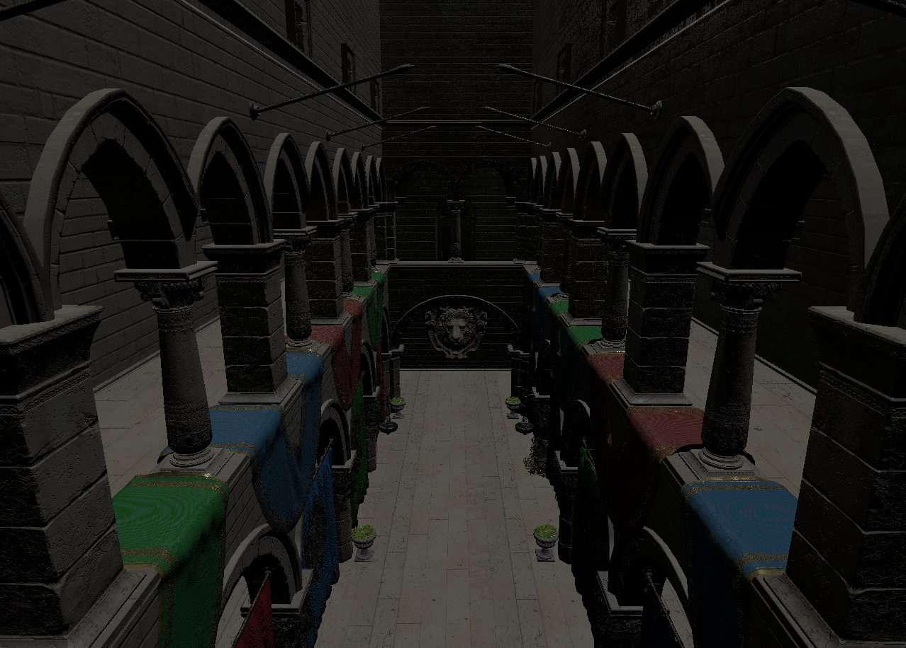
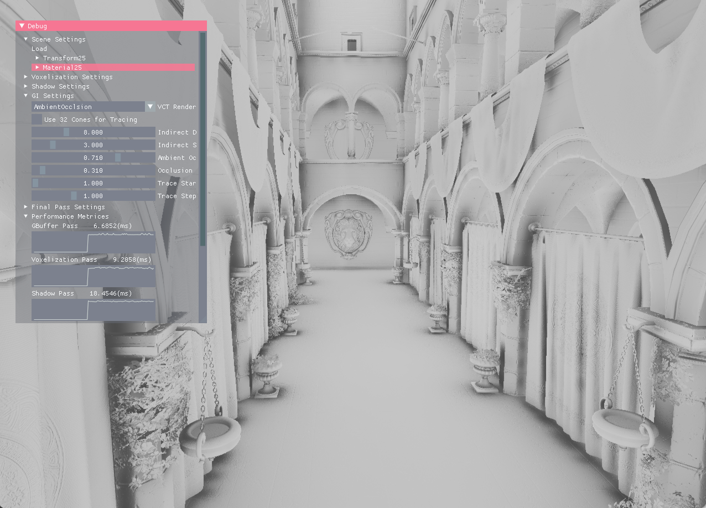

# vk_voxel_cone_tracing (WIP)
Voxel based global illumination renderer.

## Quick Start
CMake support will be added later

## Features
* Sparse voxel octree Voxel cone tracing 
	* Voxelizer (prebaking for static objects)
	* Sparse voxel octree builder
	* Octree visualizer
	* Dynamic updates for movable entities (planned)
* 3D Clipmap Voxel cone tracing
	* Opacity Voxelization
	* Shadow pass (16samples PCF)
	* GBuffer pass (diffuse, specular, normal, emission)
	* Radiance injection
	* Opacity, Radiance downsampling (WIP)
	* Toroidan Addressing (WIP)
* Common
	* Microfacet specular model for direct contribution
	* Voxel cone tracing (indirect diffuse, specular) with 16 fixed cone directions
	* GLTF scene loader
	* Directional light
	* VXAO(VoXel Ambient Occlusion)
	* Area light (planned)
* Fluid simulation
	* SPH (planned) : GPU memory particles -> cone tracing (like volumetric ray marching)

## References
* https://on-demand.gputechconf.com/gtc/2012/presentations/SB134-Voxel-Cone-Tracing-Octree-Real-Time-Illumination.pdf
* https://on-demand.gputechconf.com/gtc/2014/presentations/S4552-rt-voxel-based-global-illumination-gpus.pdf
* https://www.youtube.com/watch?v=EJTc_t3G-js
* https://www.gamedeveloper.com/programming/graphics-deep-dive-cascaded-voxel-cone-tracing-in-i-the-tomorrow-children-i-
* https://www.gdcvault.com/play/1026469/Scalable-Real-Time-Global-Illumination
* https://erkaman.github.io/posts/masters_thesis.html

## Dependencies
* GLFW (https://github.com/glfw/glfw)
* glm (https://github.com/g-truc/glm)
* Dear imgui (https://github.com/ocornut/imgui)
* tinygltf (https://github.com/syoyo/tinygltf)
* VulkanMemoryAllocator (https://github.com/GPUOpen-LibrariesAndSDKs/VulkanMemoryAllocator)

## How To Contribute

Contributions are always welcome, either reporting issues/bugs or forking the repository and then issuing pull requests when you have completed some additional coding that you feel will be beneficial to the main project. If you are interested in contributing in a more dedicated capacity, then please contact me.

## Contact

You can contact me via e-mail (sinjihng at gmail.com). I am always happy to answer questions or help with any issues you might have, and please be sure to share any additional work or your creations with me, I love seeing what other people are making.

## License

The class is licensed under the [MIT License](http://opensource.org/licenses/MIT):

Copyright (c) 2022 Snowapril
*   [Jihong Shin](https://github.com/Snowapril)

Permission is hereby granted, free of charge, to any person obtaining a copy of this software and associated documentation files (the "Software"), to deal in the Software without restriction, including without limitation the rights to use, copy, modify, merge, publish, distribute, sublicense, and/or sell copies of the Software, and to permit persons to whom the Software is furnished to do so, subject to the following conditions:
The above copyright notice and this permission notice shall be included in all copies or substantial portions of the Software.
THE SOFTWARE IS PROVIDED "AS IS", WITHOUT WARRANTY OF ANY KIND, EXPRESS OR IMPLIED, INCLUDING BUT NOT LIMITED TO THE WARRANTIES OF MERCHANTABILITY, FITNESS FOR A PARTICULAR PURPOSE AND NONINFRINGEMENT. IN NO EVENT SHALL THE AUTHORS OR COPYRIGHT HOLDERS BE LIABLE FOR ANY CLAIM, DAMAGES OR OTHER LIABILITY, WHETHER IN AN ACTION OF CONTRACT, TORT OR OTHERWISE, ARISING FROM, OUT OF OR IN CONNECTION WITH THE SOFTWARE OR THE USE OR OTHER DEALINGS IN THE SOFTWARE.